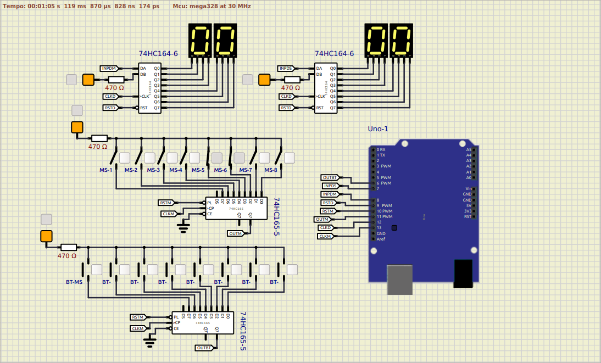

# AtendimentoMesasArduino

Descrição curta do projeto. Sua introdução deve ter cerca de 2 ou 3 linhas. Não exagere, as pessoas não vão ler.

## Feito Com:

## 🤝 Contribuição

Projeto aberto para ajuda!

Lembre de seguir os requisitos da licensa...

## 🔖 Licensa

### Support Ou Contato

Copyright © 2021 SrGambiarra

